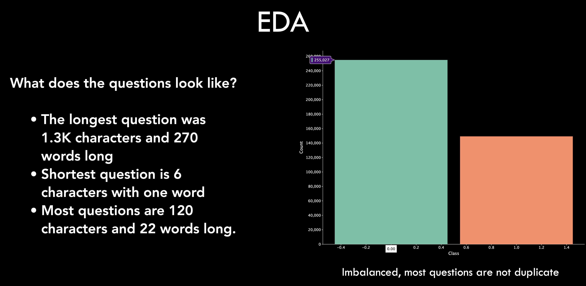
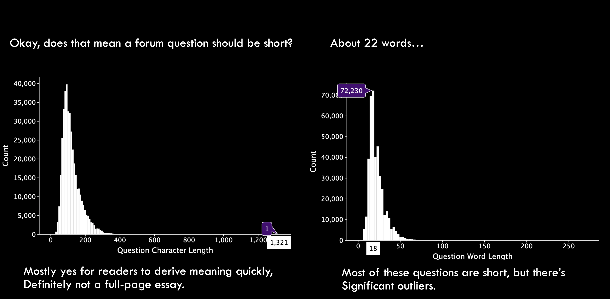
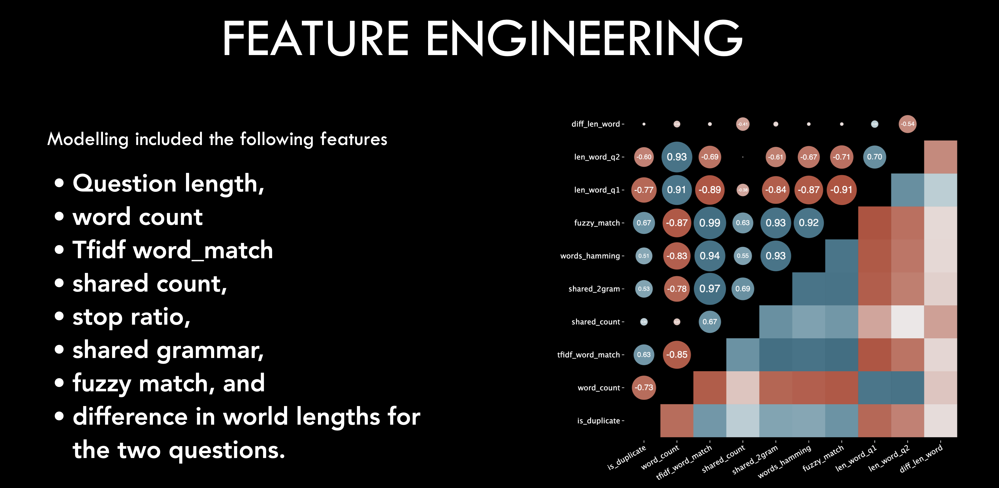
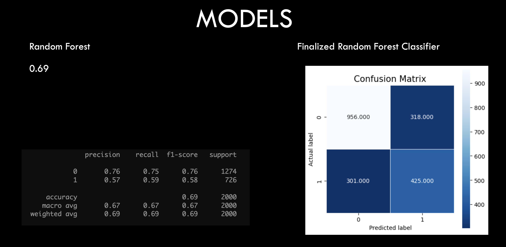
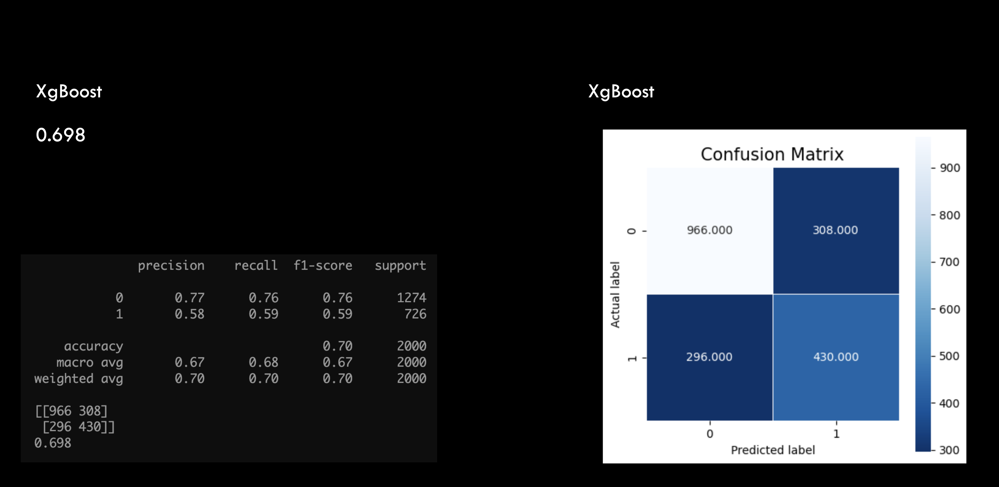
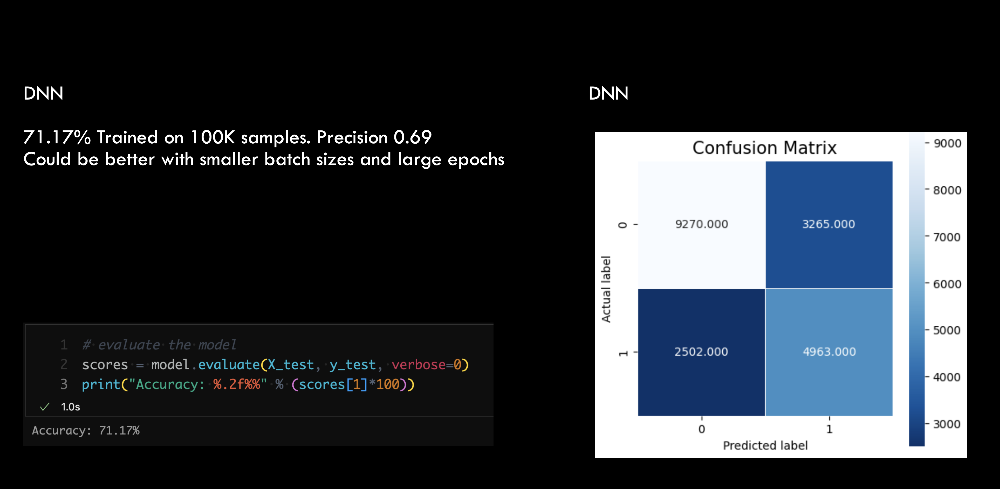

# **Classifying Duplicate Questions from Quora.**
---
 
 
 

 
 
 

# Problem
Over 100 million people visit Quora every month, so it's no surprise that many people ask similarly worded questions. Multiple questions with the same intent can cause seekers to spend more time finding the best answer to their question, and make writers feel they need to answer multiple versions of the same question.

Quora already used a Random Forest Classifier, so a better algorithm would be important to improve performance. 
 
 

# Solution
In this project, the goal is to model a classifier that can detect if a question is duplicate, or the solution to the same question already exists. I will Model a Random Forest Classifier and compare the results against DNN using NLP techniques. 
 
 

# Process

1. Download the data and load. The labeled dataset can be downloaded from [here](https://drive.google.com/file/d/19iWVGLBi7edqybybam56bt2Zy7vpf1Xc/view?usp=sharing).
   The dataset consited of two questions and a label to indicate that the question is duplicate or not. 
   
2. Data Cleaning. 
   The following operations were performed to clean the text in the data. 
   - Removing punctuations
   - Removing whitespace
   - Removing stop words
   - Removing symbols. 
   - Normalizing, and stemming. 
 - 
3. EDA. 
4. Exploratory analysis focused on the shape, structure, questions  and the distribution of the classes. There was a total of 255K non-duplicates and 149K duplicates. The longest question was 1.3K characters and 270 words long, the shortest question was was 6 characters with one word. Most questions are 120 characters and 22 words long.
   In summary, the dataset is imbalanced and contains extremes of questions characteristics that should be considered during feature engineering and modeling. 

5. Feature Engineering
   Using Spacy, Fuzzywuzzy, and nltk, the final dataset for modeling contained the following features — question length, word count	tfidf word_match shared count, stop ratio, shared grammar, fuzzy match, and difference in world lengths for the two questions.

6. Modeling different classifiers and random forest
   A test sample of 100K was drawn for faster processing and computational costs. 
   - Traditional Machine Leaning models modeled were — Logistic Regression (accuracy = 0.6755), RandomForest (accuracy = 0.6905), and Xgboost (accuracy = 0.698). Each model was evaluated in-turn and tuned. 
  
  7. NLP with DNN
   - A NN with one hidden layer and a output layer was trained as a baseline. As I increased more layers with more activation functions and higher epocs and lower batch sizes, a direct increase in the performance of the model was observed. The final model achieved a 71.1% accuracy. 
 
 

# Results

 
 

# Reflection. 
- Further improvement could be done by trainig the model with more data. 
- Explore LSTM models, could yield a higher accuracy

# Thank you! 
